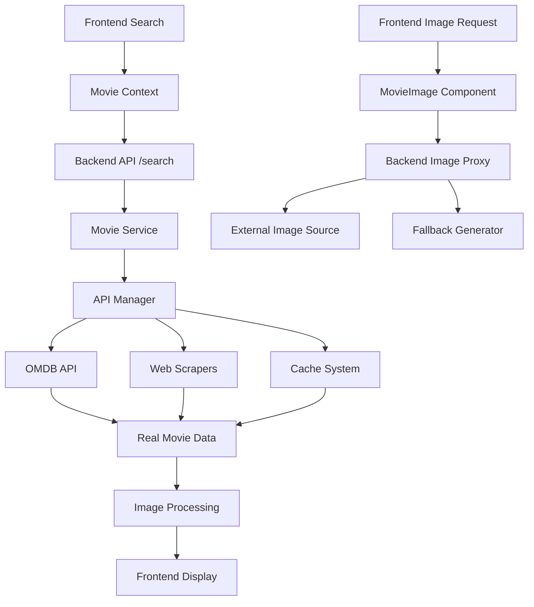
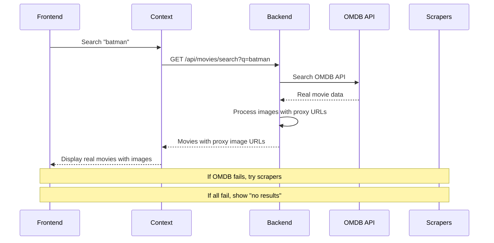
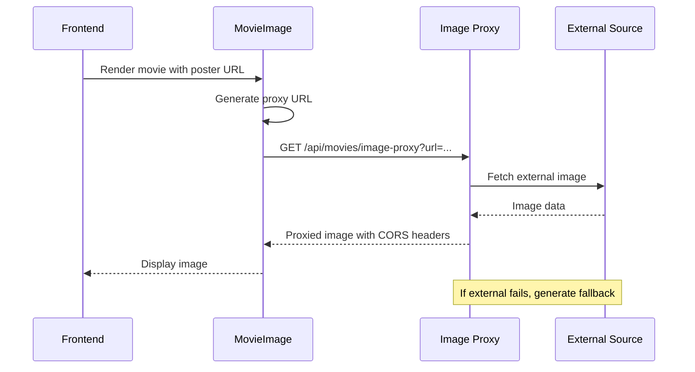

# Design Document

## Overview

This design addresses the critical issues in the CineScope movie application where images fail to load dynamically and search functionality returns demo data instead of real movie results. The solution focuses on improving the image proxy system, enhancing the search API integration, and implementing robust fallback mechanisms while maintaining performance.

## Architecture

### Current System Analysis

The current system has several architectural issues:

1. **Image Loading**: The image proxy system exists but has reliability issues with CORS handling and fallback mechanisms
2. **Search Functionality**: The movie service falls back to demo data too quickly instead of exhausting real API sources
3. **API Integration**: OMDB API integration exists but isn't being utilized effectively for search operations
4. **Frontend Image Handling**: The MovieImage component has complex fallback logic that doesn't align with backend capabilities

### Proposed Architecture



## Components and Interfaces

### 1. Enhanced Movie Service Search

**Location**: `backend/app/services/movie_service.py`

**Current Issues**:
- Falls back to demo data too quickly
- Doesn't properly utilize OMDB API for search
- Image processing is inconsistent

**Enhanced Design**:
```python
async def search_movies(self, query: str, limit: int = 20) -> List[Movie]:
    """Enhanced search with proper API prioritization"""
    # 1. Try OMDB API first (real-time search)
    # 2. Try web scraping as secondary
    # 3. Check cache as tertiary
    # 4. Only use demo data as absolute last resort
```

### 2. Improved Image Proxy Service

**Location**: `backend/app/api/routes/images.py`

**Current Issues**:
- Limited error handling
- No retry mechanism
- Inconsistent CORS headers

**Enhanced Design**:
```python
@router.get("/image-proxy")
async def proxy_image_enhanced(url: str):
    """Enhanced image proxy with retry and fallback"""
    # 1. Validate and clean URL
    # 2. Try direct proxy with timeout
    # 3. Retry with different headers if needed
    # 4. Generate fallback image if all fails
    # 5. Return with proper CORS headers
```

### 3. Frontend Image Component Optimization

**Location**: `frontend/components/ui/movie-image.tsx`

**Current Issues**:
- Complex fallback logic
- Inconsistent proxy URL generation
- Poor error state handling

**Enhanced Design**:
```typescript
interface MovieImageProps {
  src?: string | null
  alt: string
  // ... other props
}

export function MovieImage({ src, alt, ...props }: MovieImageProps) {
  // 1. Standardized proxy URL generation
  // 2. Progressive loading states
  // 3. Consistent fallback handling
  // 4. Better error recovery
}
```

### 4. Search Context Enhancement

**Location**: `frontend/contexts/movie-context.tsx`

**Current Issues**:
- Falls back to mock data too quickly
- Doesn't properly handle API failures
- Inconsistent loading states

**Enhanced Design**:
```typescript
const searchMoviesHandler = async (query: string) => {
  // 1. Always try backend first
  // 2. Show proper loading states
  // 3. Handle errors gracefully
  // 4. Only use mock data as absolute last resort
}
```

## Data Models

### Enhanced Movie Data Flow



### Image Loading Flow



## Error Handling

### Search Error Handling Strategy

1. **API Timeout**: 8-second timeout for OMDB API calls
2. **Network Errors**: Retry once with exponential backoff
3. **Empty Results**: Show "no results found" instead of demo data
4. **Service Unavailable**: Clear error message with retry option

### Image Error Handling Strategy

1. **Proxy Failure**: Attempt direct image loading
2. **CORS Issues**: Use proxy service automatically
3. **Invalid URLs**: Generate meaningful fallback image
4. **Timeout**: Show loading state then fallback

## Testing Strategy

### Backend Testing

1. **Unit Tests**: Test movie service search logic
2. **Integration Tests**: Test OMDB API integration
3. **Image Proxy Tests**: Test proxy service with various URLs
4. **Error Handling Tests**: Test fallback mechanisms

### Frontend Testing

1. **Component Tests**: Test MovieImage component states
2. **Context Tests**: Test search functionality
3. **Integration Tests**: Test end-to-end search flow
4. **Error State Tests**: Test error handling UI

### Test Scenarios

1. **Successful Search**: User searches "batman", gets real results with images
2. **API Failure**: OMDB fails, system tries scrapers, shows appropriate message
3. **Image Loading**: Images load through proxy, fallback works when needed
4. **Network Issues**: Proper error messages and retry mechanisms
5. **Empty Results**: Clear "no results" message instead of demo data

## Performance Considerations

### Caching Strategy

1. **Search Results**: Cache OMDB results for 2 hours
2. **Image Proxy**: Cache proxied images for 24 hours
3. **Fallback Data**: Cache generated fallbacks for 1 hour

### Optimization Techniques

1. **Lazy Loading**: Load images as they come into viewport
2. **Progressive Enhancement**: Show skeleton states while loading
3. **Request Debouncing**: Debounce search requests by 500ms
4. **Concurrent Requests**: Limit concurrent image requests

## Security Considerations

### Image Proxy Security

1. **URL Validation**: Validate and sanitize image URLs
2. **Rate Limiting**: Implement rate limiting on proxy endpoint
3. **CORS Headers**: Proper CORS configuration
4. **Content Type Validation**: Ensure only images are proxied

### API Security

1. **API Key Protection**: Ensure API keys are not exposed
2. **Input Sanitization**: Sanitize search queries
3. **Error Information**: Don't expose internal errors to frontend

## Implementation Phases

### Phase 1: Backend Search Enhancement
- Fix movie service search logic
- Improve OMDB API integration
- Enhance error handling

### Phase 2: Image Proxy Improvement
- Enhance image proxy service
- Add retry mechanisms
- Improve fallback generation

### Phase 3: Frontend Integration
- Update MovieImage component
- Enhance search context
- Improve error states

### Phase 4: Testing and Optimization
- Add comprehensive tests
- Performance optimization
- Error handling refinement