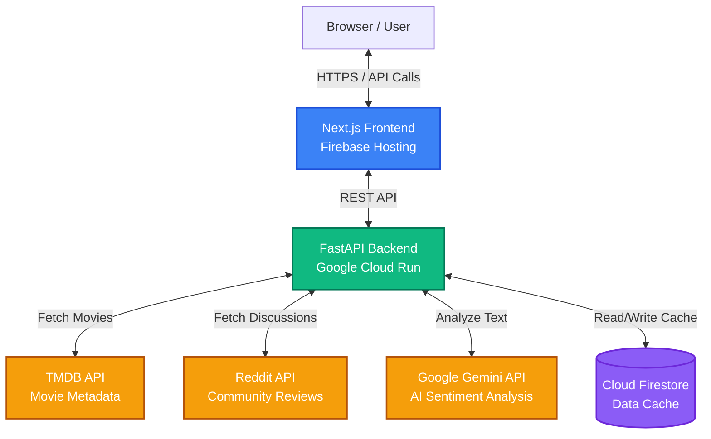

# CineScope Analyzer 🎬

CineScope Analyzer is an intelligent, full-stack web application designed to help movie enthusiasts discover films, read authentic community reviews, and get AI-powered insights. By combining data from the largest movie databases with real community discussions and advanced generative AI, CineScope provides a comprehensive breakdown of any film.

## 🚀 Key Features

- **Movie Discovery & Search**: Find any movie instantly with real-time search, powered by the TMDB API.
- **Dynamic Content**: Enjoy high-quality movie posters (smartly proxied to bypass CORS) and beautiful UI built with Next.js and Tailwind CSS.
- **Reddit Community Sentiment**: Automatically scrapes and analyzes real user reviews and discussions from Reddit communities like `r/movies` and `r/TrueFilm`.
- **Gemini AI Analysis**: Synthesizes massive amounts of text from Reddit reviews into a clean, easy-to-read summary of community sentiment using Google's Gemini AI.
- **Performance Optimized**: Uses Google Cloud Firestore to cache AI analysis and Reddit scraping results to provide lightning-fast loads for previously searched movies.

## 🏗️ Architecture

CineScope Analyzer is built with a modern, decoupled architecture. The frontend is a React application built on Next.js, and the backend is a Python REST API powered by FastAPI.

## 🛠️ Technology Stack

### Frontend
- **Framework**: Next.js (React)
- **Styling**: Tailwind CSS & Framer Motion
- **Hosting**: Firebase Hosting

### Backend
- **Framework**: FastAPI (Python)
- **AI Integration**: Google Generative AI (Gemini Pro)
- **Database/Cache**: Google Cloud Firestore
- **Hosting**: Google Cloud Run (Dockerized)

### Third-Party APIs
- The Movie Database (TMDB)
- Reddit API (OAuth Client Credentials)
- OMDB API

## 💻 Getting Started (Local Development)

### Prerequisites
- Node.js (v18+)
- Python 3.10+
- A Google Cloud Project with Firestore enabled
- API Keys for TMDB, Reddit, and Gemini

### Backend Setup
1. Navigate to the `backend/` directory.
2. Create a virtual environment: `python -m venv venv`
3. Activate the virtual environment.
4. Install dependencies: `pip install -r requirements.txt`
5. Copy `.env.template` to `.env` and fill in your API keys.
6. Run the server: `python -m uvicorn app.main:app --reload --port 8080`

### Frontend Setup
1. Ensure you are in the root directory.
2. Install dependencies: `npm install`
3. Set up the local `.env.local` to point to the backend (e.g., `NEXT_PUBLIC_API_URL=http://localhost:8080/api`).
4. Run the development server: `npm run dev`

---
*Built with ❤️ for movie lovers.*