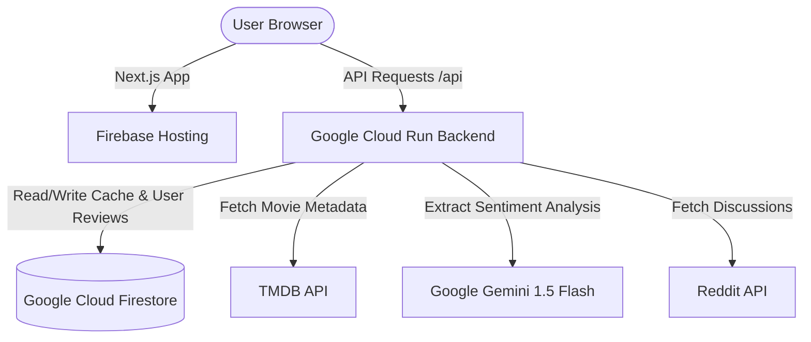

# 🚀 GCP & Firebase Deployment Guide

This guide describes how to deploy the CineScope Complete Movie Analysis stack to Google Cloud Platform (GCP) and Firebase.

## Architecture Diagram



---

## 📋 Deployment Steps

### ✅ **STEP 1: Firebase Project Setup**
1. Go to the [Firebase Console](https://console.firebase.google.com/).
2. Click **Add Project** and name it `cinescope-analyzer` (or your preferred project ID).
3. Enable **Google Analytics** (optional but recommended).
4. Click **Create Project**.
5. Once created, upgrade the project to the **Blaze (Pay-as-you-go) Plan** to support Cloud Run integrations.

---

### ✅ **STEP 2: Provision Cloud Firestore**
1. In the Firebase Console, go to **Firestore Database** in the left menu.
2. Click **Create Database**.
3. Choose **Native Mode** (recommended for web applications).
4. Select a location close to your users (e.g., `us-central1`).
5. Set Security Rules to **Test Mode** initially (or production mode with proper auth rules).
6. Click **Create**.

---

### ✅ **STEP 3: Deploy Backend to Google Cloud Run**
We host our FastAPI Python backend as a container on Cloud Run.

1. Ensure the [Google Cloud SDK (gcloud CLI)](https://cloud.google.com/sdk/docs/install) is installed and authenticated:
   ```bash
   gcloud auth login
   gcloud config set project YOUR_PROJECT_ID
   ```
2. Navigate to the `backend/` directory:
   ```bash
   cd backend
   ```
3. Deploy the container using Cloud Run (this builds the container securely using Cloud Build and deploys it):
   ```bash
   gcloud run deploy cinescope-backend \
     --source . \
     --platform managed \
     --region us-central1 \
     --allow-unauthenticated
   ```
4. During deployment, or in the Google Cloud Console, configure the following environment variables on the Cloud Run service:
   - `TMDB_API_KEY`: Your TMDB Developer API Key.
   - `GEMINI_API_KEY`: Your Gemini API Key.
   - `REDDIT_CLIENT_ID`: (Optional) Reddit App ID.
   - `REDDIT_CLIENT_SECRET`: (Optional) Reddit App Secret.
   - `REDDIT_USER_AGENT`: (Optional) Custom Reddit User Agent string.
5. Capture the service URL returned by the CLI (e.g., `https://cinescope-backend-xxxxxx.a.run.app`).

---

### ✅ **STEP 4: Deploy Next.js Frontend to Firebase Hosting**
Firebase Hosting provides native framework support for Next.js SSR (Server-Side Rendering) applications by automatically packaging them.

1. Enable the Firebase Web Frameworks experimental feature:
   ```bash
   firebase experiments:enable webframeworks
   ```
2. Authenticate the Firebase CLI:
   ```bash
   firebase login
   ```
3. Set the environment variable for Next.js to point to your Cloud Run URL:
   - On Windows (PowerShell):
     ```powershell
     $env:NEXT_PUBLIC_API_URL="https://your-cloud-run-url.run.app"
     ```
   - On Linux/macOS:
     ```bash
     export NEXT_PUBLIC_API_URL="https://your-cloud-run-url.run.app"
     ```
4. Deploy the frontend to Firebase:
   ```bash
   firebase deploy --only hosting
   ```
5. Firebase CLI will build your Next.js application, compile the assets, and deploy the application.
6. Once completed, your web application will be live at `https://cinescope-analyzer.web.app`!

---

## 🔧 Environment Variables Summary

### Backend (Cloud Run)
| Variable Name | Purpose | Example |
| :--- | :--- | :--- |
| `TMDB_API_KEY` | TMDB movie database search & metadata | `abc123xyz...` |
| `GEMINI_API_KEY` | Gemini LLM sentiment & review summarization | `AIzaSy...` |
| `REDDIT_CLIENT_ID` | Reddit API crawler client id | `reddit_client_abc123` |
| `REDDIT_CLIENT_SECRET`| Reddit API crawler secret | `reddit_secret_abc123` |

### Frontend (Firebase Hosting)
| Variable Name | Purpose | Example |
| :--- | :--- | :--- |
| `NEXT_PUBLIC_API_URL` | Base URL of deployed Cloud Run API | `https://cinescope-backend-xxxxxx.a.run.app` |

---

## 🔍 Verification & Health Monitoring

1. **Verify API connectivity**:
   Open `https://your-cloud-run-url.run.app/health` in your browser. It should return:
   ```json
   {
     "status": "healthy",
     "services": {
       "api": "available",
       "firestore": "available",
       "gemini": "available"
     }
   }
   ```
2. **Access Swagger UI Docs**:
   Navigate to `https://your-cloud-run-url.run.app/docs` to view and try the API routes interactively.
3. **Verify CORS preflight handling**:
   Ensure preflight OPTIONS requests are handled with Status 200 OK by client-side browser agents.
